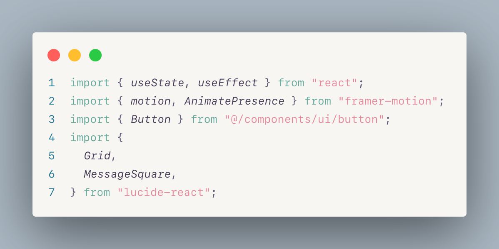

# 🌸 JVLDS Theme

Escape into jvlds, our pastel theme, now with a dark mode. Like coding in a field of wildflowers under a gentle sun, or watching fireflies dance in a twilight meadow, jvlds brings tranquility to your screen, day or night.

## ✨ Preview

## 📦 Installation

1. Open the Extensions sidebar in VS Code
2. Search for "jvlds-theme"
3. Click Install
4. Select "JVLDS Pastel Theme" from File → Preferences → Color Theme

## 🌟 Features

- Carefully chosen pastel colors that are easy on the eyes
- Designed for long coding sessions in bright environments
- Supports multiple languages

## 💝 Recommended Font Pairings

- Geist Mono
- MonoLisa
- JetBrains Mono
- Operator Mono
- FantasqueSans Mono

## 🤝 Contributing

Found a bug or want to suggest improvements? Feel free to:
- Open an issue
- Submit a pull request
- Share your feedback

## 📄 License

MIT License - Feel free to use and modify this theme for your personal or professional projects!

## 🙏 Credits

Created with love by the jvlds team

---

Enjoy coding :)
